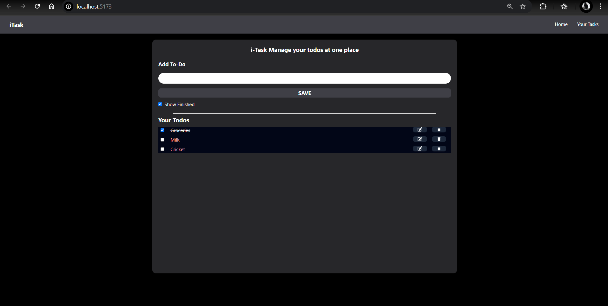

# To-Do Application

This is a simple To-Do application built with React. It allows users to manage their tasks efficiently by adding, editing, deleting, and marking tasks as completed.

## Features
- Add new tasks.
- Edit existing tasks.
- Delete tasks.
- Mark tasks as completed or uncompleted.
- Toggle visibility of completed tasks.
- Persistent storage using `localStorage`.

## Technologies Used
- React
- Tailwind CSS
- React Icons
- UUID for unique task IDs

## Screenshot


## How to Run
1. Clone the repository:
   ```bash
   git clone <repository-url>
   ```
2. Navigate to the project directory:
   ```bash
   cd To-do
   ```
3. Install dependencies:
   ```bash
   npm install
   ```
4. Start the development server:
   ```bash
   npm start
   ```

## License
This project is licensed under the MIT License.
