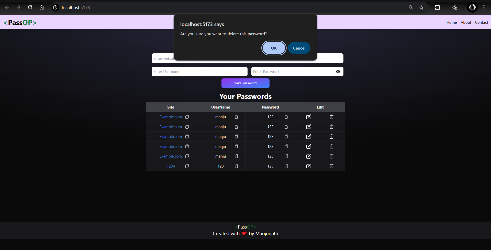
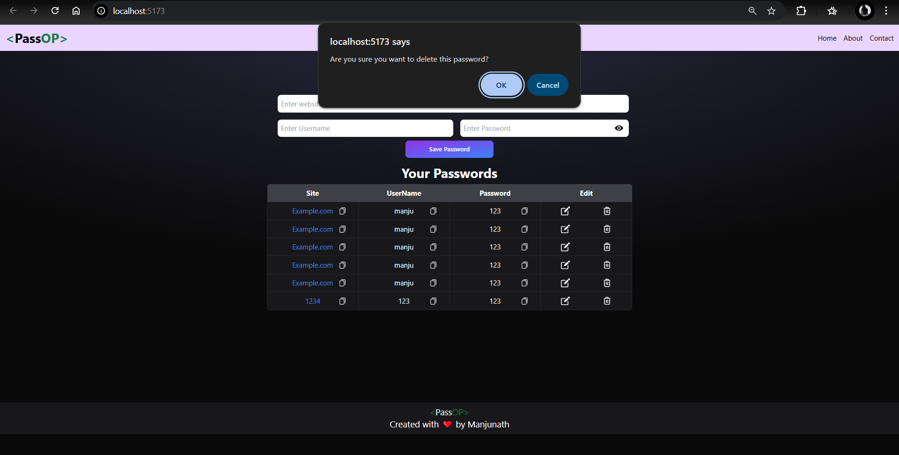

# PassOP - Password Manager

PassOP is a simple and responsive password manager application built with React. It allows users to securely save, edit, and delete their passwords. The application also provides features like copying passwords to the clipboard and toggling password visibility.

## Features
- Add, edit, and delete passwords.
- Copy passwords or other fields to the clipboard.
- Toggle password visibility.
- Responsive design for all screen sizes.
- Data persistence using `localStorage`.

## Screenshots

### Home Page


### Password List


## Installation

1. Clone the repository:
   ```bash
   git clone https://github.com/your-repo/passop.git
   ```
2. Navigate to the project directory:
   ```bash
   cd passop
   ```
3. Install dependencies:
   ```bash
   npm install
   ```
4. Start the development server:
   ```bash
   npm start
   ```

## Technologies Used
- React
- Tailwind CSS
- React Toastify

## License
This project is licensed under the MIT License.
